# Assessment: Real-World Application - Part A

## Description of Website

### Purpose
The weExplore website is designed to accompany and facilitate weExplore, in running and managing events.

weExplore is a not for profit organisation based in Clayton, Victoria, providing health education to promote holistic health and well-being for the communities. Their mission is to promote a holistic healthy lifestyle. They do this by educating their members in physical, emotional, mental and spiritual health through running events such as cooking classes, pilates, and health seminars. 

The purpose of the website is to provide the ability for weExplore to create events and post them to the site there webpage where their members can sign up to attend the events and receive information about upcoming events.

Finally, it allows the administration of weExplore to have access to a master database of their members. This lets the administration have a greater understanding of their member’s metrics and their needs to be able to cater specifically to events of their liking. 

Currently weExplore use MeetUp and word of mouth to promote their events. Through the build of a custom website, weExplore will have further reach to a wider audience and a consistent event management system. 

### Functionality

The main functionality of the weExplore website is the ability for administrators to create events and for members to sign up and confirm their attendance for the events. 

It will contain a feed with upcoming events that are available for members to attend in an easy, informative and friendly design. The website will exemplify the passion and dedication weExplore has to health education and holistic wellbeing. 

Furthermore, the website will allow the administrators of weExplore to have access to a database of their users and the events the users are attending. This will allow them to gain a comprehensive understanding of their user’s wants, needs, and interests concerning their health. 

Finally, the weExplore website will be the primary source for the members to find out more about the company, services offered and contact information. This will be accessible through different pages of the website. 

The site will have a main navigation bar to allow ease of accessibility for all pages. It will contain the main events component with a singular event component and the ability to “click” attending events. 

Furthermore, it will contain the functionality to sign-up, login, and sign-out of the members portal. As well as signing in to the administrator portal and display the admin dashboard to create, edit and delete events. 

### Features

Members sign-up/login
- Authentication, encryption, and token generation.

A feed of upcoming events that is viewable by all visitors on the site, not just members.
- Ability to filter by interests/date/length of the program and location 
- Calling of API from different endpoints.

The ability for members to sign-up to an event and/or program.
- Use of Google Calendar plugin for members to receive a calendar invite to the events/programs.
- Automated emails sent to attendees reminding them of upcoming events.
- Automated email blast to members about upcoming or related events. 

Static pages holding information about and contact details of weExplore
- Email sign up/ subscription service.
- Minimal and accessible layout of information

Admin dashboard
- Ability to create/edit/delete an event where the event feed updates instantly.
- A custom event creation form for administration.
- Ability to access and view attendees of organised events.

### Target audience
The target audience for the weExplore website is the wider community of Clayton, Victoria who are seeking health advice, education and a group that has similar interests in health and wellbeing. 

#### The current members’ metrics are: 
Roughly the age range is between mid 20’s all the way through to mid 40’s. Consisting of a variety of demographics and socioeconomic status, however, predominantly the members are of middle socioeconomic status. The members consist of students from surrounding universities particularly from Monash university, young professionals and young families. Many have low computer literacy.  
The target audience will initially consist of the current member base that is part of the MeetUp group. However, the aim is to expand the reach to more members of the community who are seeking and in need of support with their health and overall wellbeing. 

### Tech Stack

Database Management:
- MongoDB Atlas

Application:
- Amazon S3
- Javascript
- Node.js 
- Express.js
- Mongoose
- React.js
- Html & CSS/SASS
- Jest

DevOps:
- Github

Deployment:
- Heroku
- Netlify

Project Management/Misc: 
- Trello
- Slack
- Google Docs

## Dataflow Diagram  
Below are diagrams of level 0 and level 1 of the dataflow for the *we Explore* web application  
 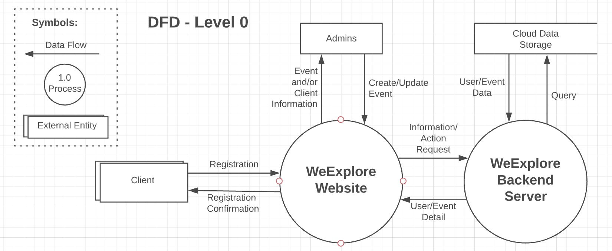  
 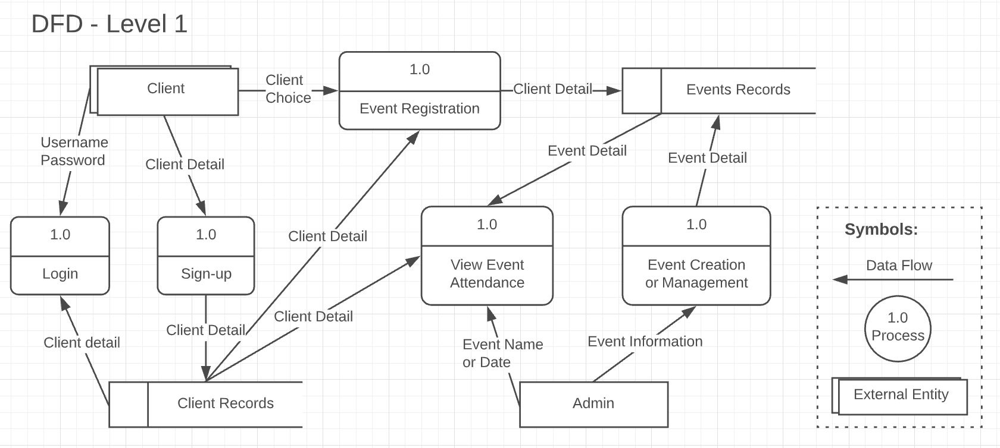  

## Application Architecture Diagram

The application’s architecture is using MERN stack. The diagram demonstrates the interaction between the services, frameworks and applications. The high level overview is further discussed below. 

Front-End Development
- The User Interface (UI) is developed using a combination of HTML, CSS and JavaScript.
- React JS, a JavaScript library is used to build the UI portion of the website. This includes the implementation of the UI and the interactive components of the application. React also contains the logic for the interaction with back-end (Express web server). That is the  operations for sending or modifying members and events data in the database.
- The application will be hosted on Netlify, a website hosting service. 

Back-End Development
- Express JS is used to build the Web server framework. It contains the logic for the interaction between the application and the Database. Specifically, it contains the logic to the querying, reading, modifying and deleting of members and events data.
- Mongoose is an Object Data Modeling (ODM) library for Express, that contains the logic, modeling environment and connection to MongoDB.  The mongoose model provides the interface for the CRUD operations. Mongoose also allows the creation of Schema, which dictates how the database is constructed.
- The backend is built on Node JS. Node allows us to execute JavaScript code outside of the browser.
- The back-end will be hosted on heroku, a web server hosting service. 

Databases
- Data will be hosted using MongoDB, which is a non-relational database. The database is hosted on MongoDB Atlas. All the data about members and event/program details are included inside the MongoDB. 
- AWS S3 is used to store images relating to the events. The image URL is used and stored inside the MongoDB. It’s then able to be retrieved by the application by querying the specific data from the database.  

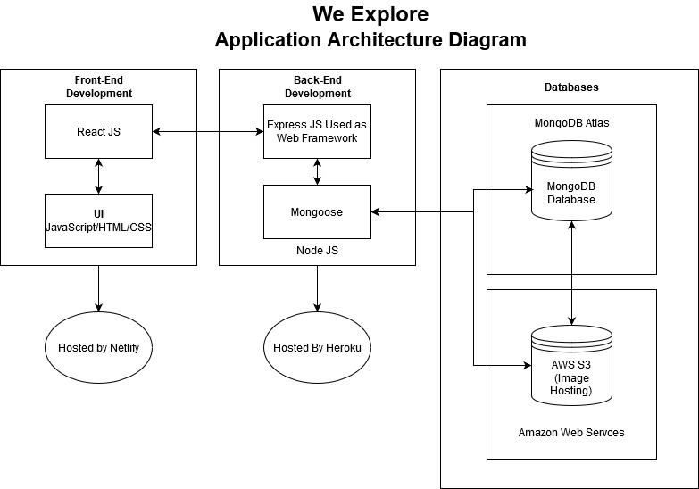

## User Stories
The user stories were generated using the agile user story methodology. User stories were created using the following structure:

*As an [user] I want to [desired function] so that [desired outcome].* 

User stories are essential to agile projects as they allow the team to put people (end users) first, and therefore build functionality and components that satisfy the user’s needs and wants. The creation of the user stories allowed our team to understand what we were building and why we were building these components. User stories ensure that our design and development are human-centered.  

Our process below follows the structure of generating user personas. Then creating non-technical user stories for these personas.

Below each user story, we have generated technical functions, features, and components that are required to meet the definition of done for each user story.   

In kanban style, these user stories will populate our backlog and become one unit of work for a member of the team to complete during the build phase.

The user stories were developed through a series of questions and surveys sent to our client, the director of weExplore. 

### Administration User Persona
**Role:** Administration, Manager of weExplore

**Motivation:** To help members of the community achieve good health and overall wellbeing, provide access to the community to health services and health education. Create a successful and impactful not for profit. To better understand their members and their health needs and/or wants.  

**Pain-points:** Do not have a central point of call where they can promote their services, events and contact details. Do not have access to a master database of their members, so they do not understand their clientele or have definitive data on what members are going to what events.

#### User story #1
**As the director of weExplore I want the ability to create and promote our events in one place so that our community knows where to find out information and to reduce work time for me.**  
Technical Features/ Definition of done:  
- Custom create event form using React and Redux forms
- This form will be available from the admin dashboard page
- Event API endpoints Create/Get/Edit/Delete  
- Fields required: Title, Description, Date + Time, Category, Kid-friendly, Presenter(s) information ( name, avatar, qualifications, short bio), recurrence/ frequency, maximum number of attendees and Image related to event.  
- On submit the information is retrieved by the server and sent and stored in the database. 
- This event information is then retrieved by the server and rendered on the "all events" page in React to display to the users instantly.
- If possible this information is automatically linked to MeetUp.com and the weExplore socials. I.e. an automatically generated FaceBook post using the image, title and description of the event.      

#### User story #2
**As the director of weExplore I want to have access to our master database so that I understand the needs and wants of our members and can cater to these findings.**  
Technical Features/ Definition of done:  
- Have an administration dashboard that once the admin log ins automatically gets redirected to.
- The admin dashboard displays: Events created, "create event" button and list of users.  
- Admin can click on a singular event created and be redirected to a component that displays: Event details, edit or delete buttons and information regarding users attending those events.  
- The list of users is interactive and the administration can click on an individual user and see what events they have previously attended. 
- Users need to have a field (array) that stores the ID of events they have attended.   

#### User story #3
**As the director of weExplore I want an admin only login so that I can access the database and create events with the assurance of security and proper authentication.**  
Technical Features/ Definition of done:  
- Credentials for administration that generates an admin only token using jwt.
- Boolean field in the user sign up that is "true" for admin.
- Middleware in the server that checks the administration token. 
- Password is hashed and salted.
- This token provides the authorisation to create/edit/delete events and have access to the master database.

### User Persona's
#### User Persona #1 
**Role:** Community member, has been attending weExplore events regularly, young professional.  

**Motivation:** Attends weExplore events as it is a safe and supportive community. Wants support with their nutrition and cooking ability. Attends regular seminars on healthy cooking and is learning a lot about good nutrition on a budget.  

**Pain-points:** Has to continue to regularly check MeetUp.com for new events, is not a member of weExplore and would like to be. Sometimes they cannot attend the events and would like to inform weExplore of attendance change.

#### User story #1  
**As a member of weExplore I want to be able to securely login and have my credentials remebered so that weExplore have my details and I have a personalised experience**  
Technical Features/ Definition of done:
- Users will sign up on the signup page.  
- API end point for user sign-up/login   
- Signup page contains a React/Redux form component. The initial state of the inputs is null until the user enters their details and hits submit. The component stores the user’s inputs into an object that is sent via a post request to the back-end server.
- Express will take the information provided by the Front-end and send that data into the Mongo database to be stored.  
- After the user has completed their registration, they will remain logged in.  
- When signup is completed, they are either redirected back to the home page or back to the event page they were looking at depending on the situation.   
- Authorisation token is generated in the back-end and sent to the header to allow user to interact with events. 
- Sign-up form fields are run through validations to ensure correct formating and presence. 
- Passwords are hashed and salted for security 
- Additionally, this user would require updates on upcoming or future events, and they would opt-in for newsletters and emails. They achieve this by clicking a tick box in the form, which stores a ‘true’ value in the database. This allows admin to generate a list of users who wish to receive newsletters and emails and complete an email blast when necessary.  

#### User story #2
**As a member of weExplore I want to be able to sign up for an event and get a reminder on the web application so that weExplore are aware of my attendance and I can be organised**  
Technical Features/ Definition of done:
- Users can browse and explore all events without signing in 
- To attend an event a user must log in or sign up
- Users browse through all events on the event page where an API endpoint is created to get all events  
- Events are presented in the form of cards where the user can click on the card and routes to the single event page where an API endpoint is created to get a single event based on an ID
- Once they click attend on an event, it prompts the application to send their user’s ID to an array stored inside the event’s database and sends the user a calendar invite through Google Calendar using its API.    
- where they browse the events page for upcoming events. Events are presented in the form of cards where the user can click on the card, which routes them to the event. On this event page, the information will come from database, which uses a get request and the event ID to populate that data into the react component. 
- At the bottom of the page, there will be a bar with a button ‘attend’. For user to attend the event, they would need to press this button. The button will store the user’s ID and send a post request to the server where the user’s ID is stored inside an array for the event.   

#### User story #3
**As a member I want to be able to search for events by category, date or kid-friendly so that I can find the events suited for my needs and not have to scroll through all the events.**  
Technical Features/ Definition of done:  
- All the events are mounted on load through calling to the server which calls to the MONGODB database
- events have a property "category"
- Drop down button to search by category
- Drop down options include all the categories available, where the user clicks on the category they want to see events related to.  
- Function required in the events component in React that maps through the array of events and filters in the ones that match the category selection. 
- The selected events are rendered to the page for the user to interact with. 
- Drop down button to organise by date (most recent to least recent)
- Events will have a date/time field 
- If the order has been changed a function in the events component that reorganises the order of the events array is called.
- Events are rendered on the page in new order.
- Button to filter by kid-friendly which triggers a function that itterates through the array of events and only renders ones that have been labelled as kid-friendly
- The events have a field (boolean) to set if the event is kid-friendly.   

#### User story #4
**As a busy user I want to be able to change my attendance status online to an event so that I can let weExplore know I will no longer be attending and won’t feel bad.**   
Technical Features/ Definition of done:  
- User will need the ability to login to their account for the server to retrieve their user ID and store this in the component state. 
- The status on the event page for this particular user is "attending"
- A button based off the state of the user in the store of the component needs to be available with the label/value of "unattending"  
- Once this button has been clicked the state changes which sends a patch request to the server to remove the user's ID from the array of attendees in the event where the server makes these changes to the database.  
- Notification is sent to the user informing them of these changes made. 
- The button "unattend" toggles to "attend" due to the state change in the store.    

#### User Persona #2
**Role:** New member of the community and has driven past weExplore, yet to attend any of the events but is seeking support for their mental health.  

**Motivation:** Is wanting to take action for their mental health and find a supportive group or community where they can learn how to take better care of themselves. Drives past weExplore and has googled their company/organisation.  

**Pain-points:** Struggling to find information about what weExplore does. Wants to reach out but only finding a meetup.com website, is seeking something of a more professional standard or has their own website. Wants to know what services and events weExplore host.  

#### User story #5
**As a not yet user of weExplore I want to be able to scroll through and see all the events on offer without having to sign up so that I don't have to hand out my details when I am not ready**  
Technical Features/ Definition of done:  
- Upcoming events on the homepage that is viewable by all users. 
- Events are displayed in cards with images and visuals being the priority
- Event details to be displayed in the cards: Image, icon to represent category, date of event, title of event, presenter name and icon. 
- Ability to click on the entire card that will send them to the singular event page for more information. 
- A fixed bar at the bottom with button "attend" to emphasise the priority of attending the event will be rendered. 
- A singular event page will contain: Title, image, description, kid-friendly or not, dates, past testimonials (if this event has been held before).
- Once the user clicks "attend" if they are not a member they will be redirected to the sign up page.  

#### User story #6
**As a not yet user of weExplore I want to be able to know more about weExplore so that I can make an informed decision on whether I want to user their services or not.**  
Technical Features/ Definition of done:  
- Static about page that is available to all users.
- About link on the main navigational bar 
- About link on the home page    

#### User story #7
**As a user I want to read reviews or testimonials on past events at weExplore so that I can assess whether the events are worth going to and of good value.**  
Technical Features/Definition of done:  
- Testimonials are rendered on the about page as this apge is accessible by all users.  
- Testimonials/reviews attached to events about similiar past events.  
- The ability for users to review an event they attended either through an email service or logging in clicking on event attended and a star system and comment box available for the user to make these testimonials/ reviews.     

#### User Persona #3  
**Role:** Has attended one event at weExplore with a friend. Really enjoyed the Pilates class.  

**Motivation:** Wants to lose some weight and strengthen their core through a non-impactful but hard-working exercise. Needs regular accountability. Also wants some more advice with overall wellbeing and nutrition.  

**Pain-point:** Wants to go to more events at weExplore as really likes the Pilates class but unsure of what other events weExplore has to offer. Would like regular updates on what is going on at the centre and of any changes. Would like a link or website to forward to family and friends who would benefit from weExplore.  

#### User story #8
**As a new user of weExplore I want to be able to contact them so that I can learn more information that is specific to me.**  
Technical Features/ Definition of done:
- Static contact page with all the details on how weExplore is contactable.
- Contact link on main navigational bar
- Contact link on the about page.   
- On the contact page provide links to weExplore's various social media outlets like FaceBook and Instagram and as that is a point of call for many of their users. 
- Using a service like mailgun, create a contact form that can generate an email service for users to email the weExplore administration.  

#### User story #9
**As an attendee of an event to weExplore I want to know who is going to be presenting and their qualifications so that I know the event I am attending is worthwhile and legitimate.**  
Technical Features/ Definition of done:  
- Presenter field on the event form
- Presenter is its own collection with the following properities: Name, Qualifications, Avatar, Description, Contact details (i.e. social media or website links).
- Administration inputs this information into create event form. (React-redux form). 
- The server grabs this information (through POST request) and saves and stores it in the database. 
- Ability of the admin to auto populate the presenter fields if presenter has spoken before.
- The Presenter information is rendered on the event page that a user can click on and have access to.          

## Wireframes
### Desktop Views
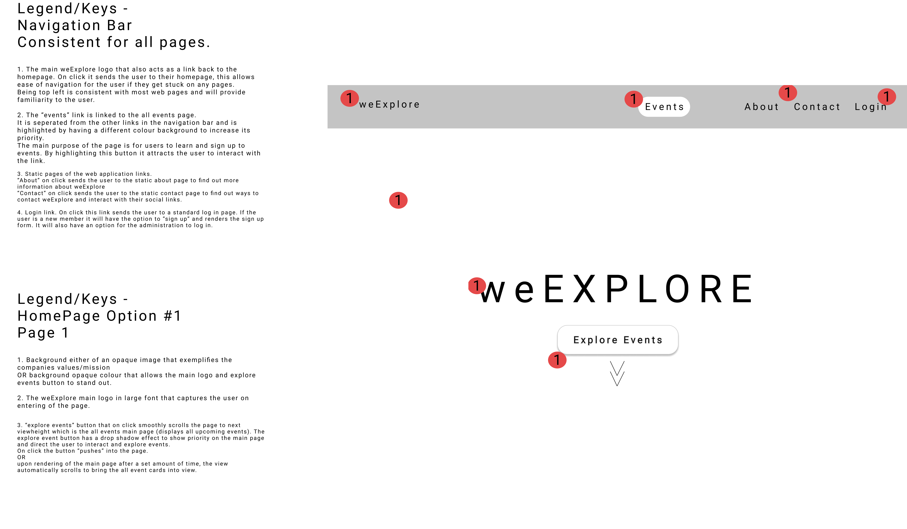
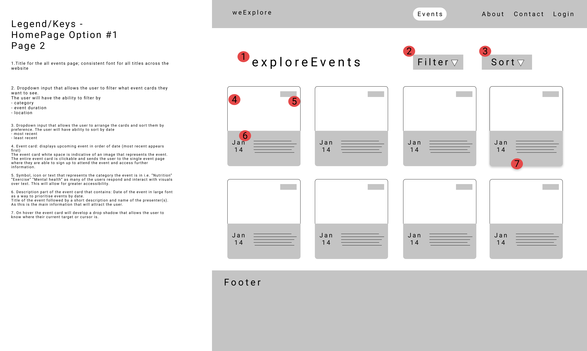

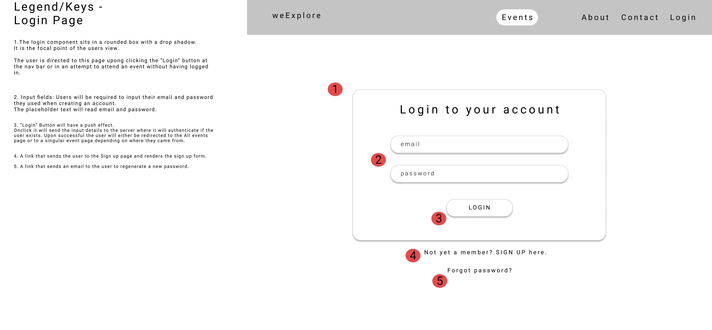
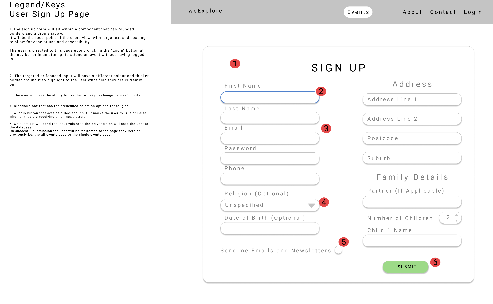
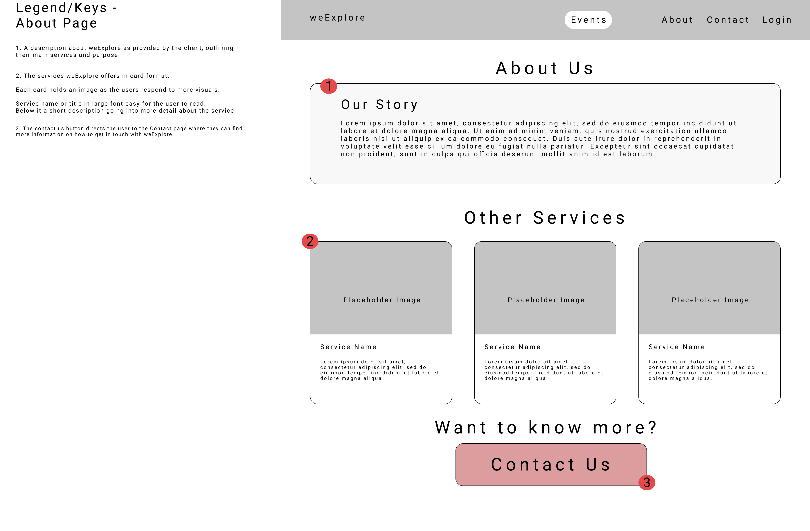
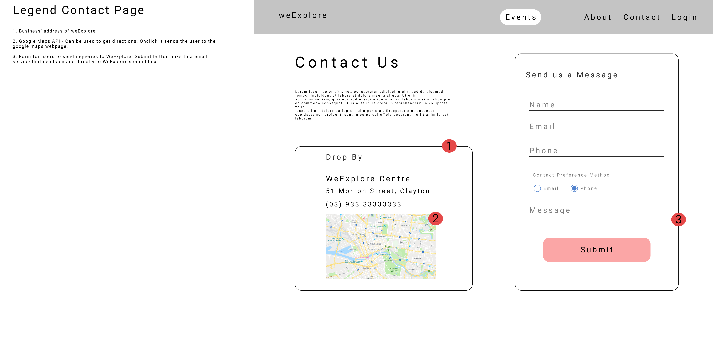
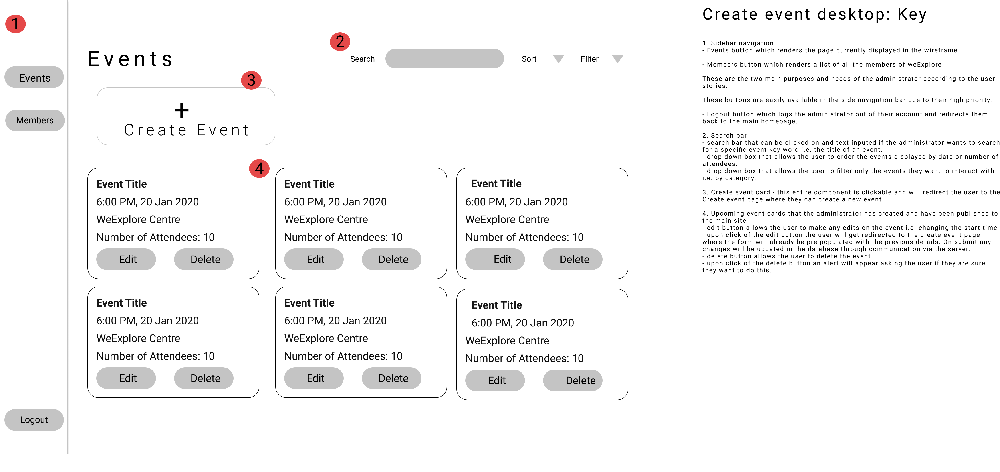
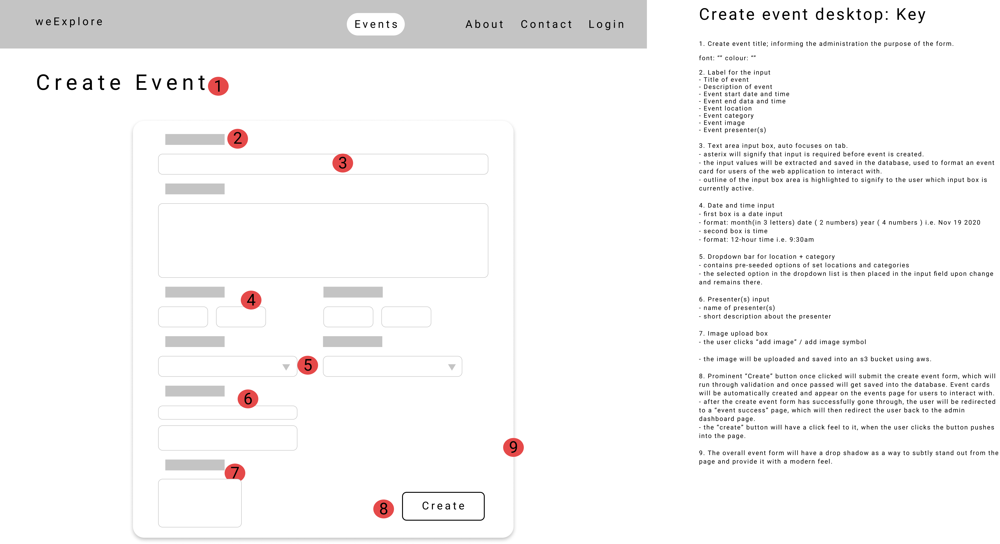

### Mobile Views
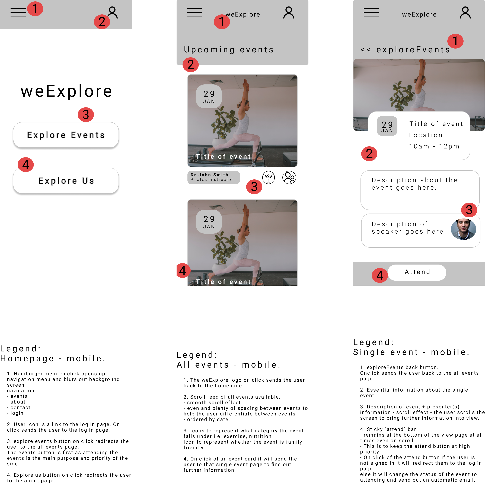
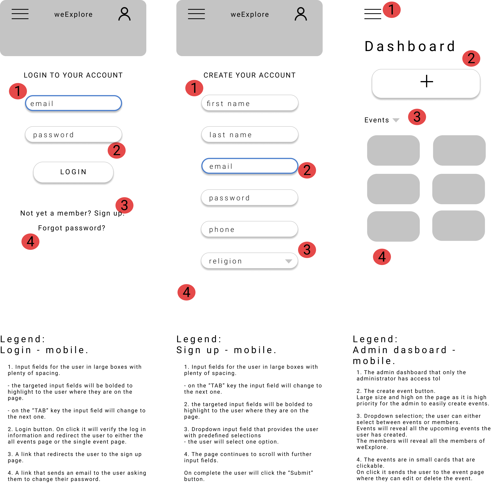

## Project Management
Our team to follow agile methodology used Kanban, a style of agile.  
Kanban uses the style of creating a backlog and then each unit of work in a backlog is a cycle of work that is worked on and then "deployed" to allow for the method of continuous development. Units of work or tickets were assigned to a team member and a dead line was set to achieve the cycle of work. 
Once the task was undertaken it was moved from the "To do" backlog to the "Doing". On completion by the team member it was moved into the "done" section for it do be reviewed by the other team members before being moved into the "Done Done" section.  
Below are screenshots of how we used a Trello board to follow the Kanban style and manage our project for Part A.      
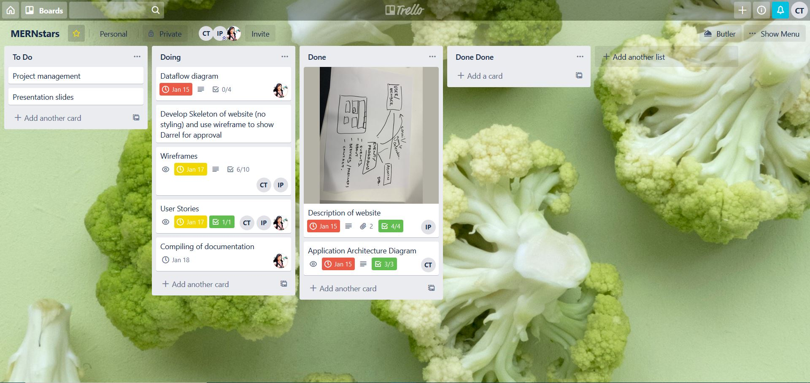
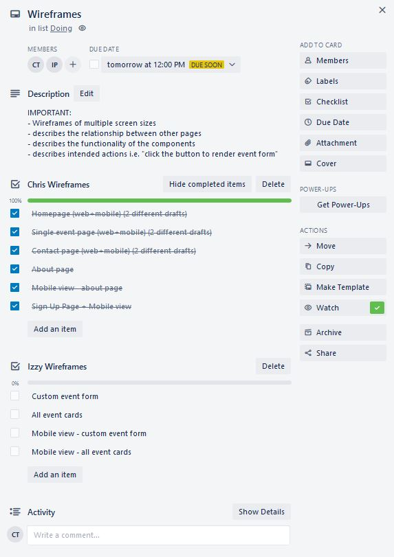

